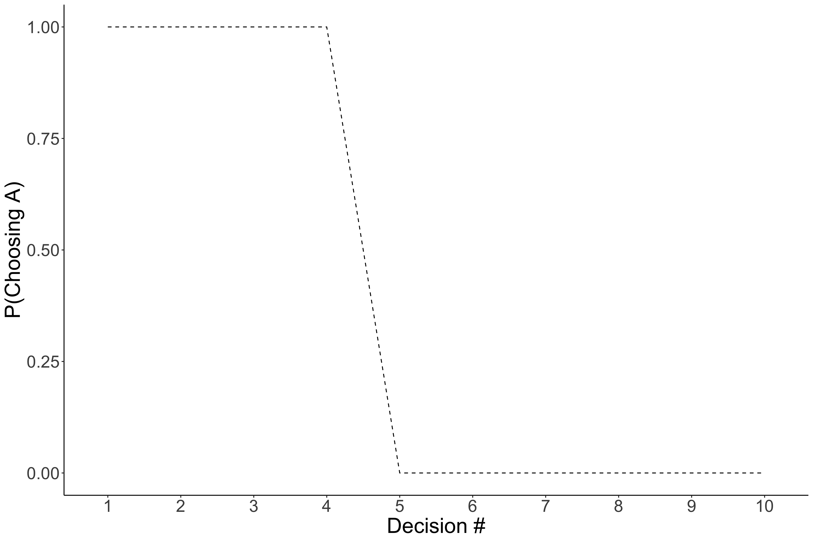
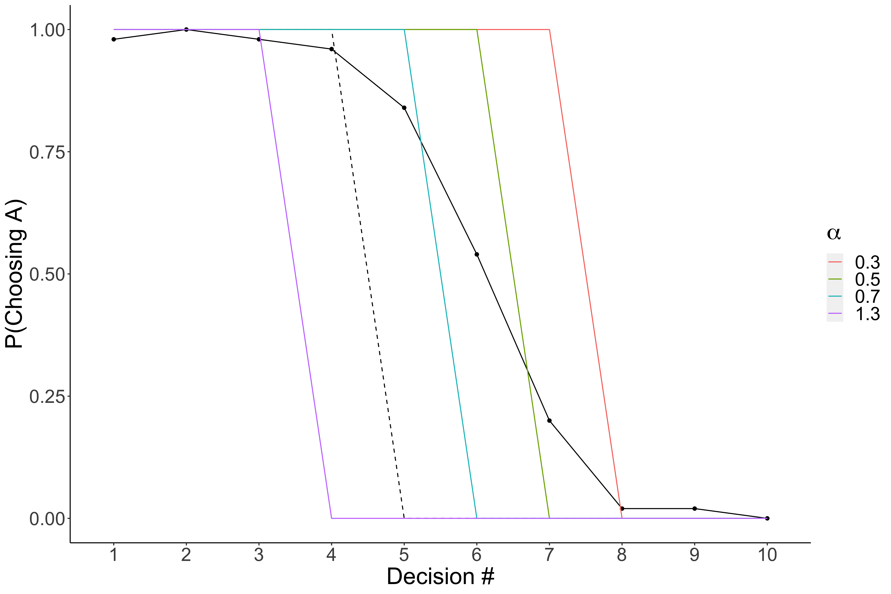
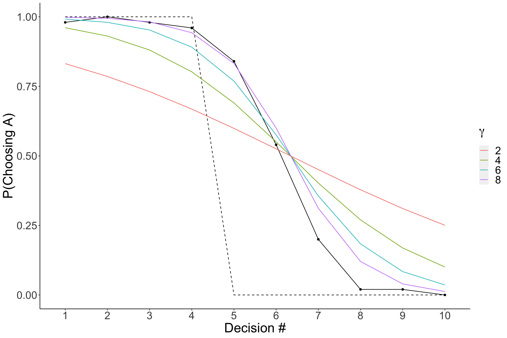

 

## Takeaways

**[Estimated Read Time 20 mins]**

In this blog you will learn the basics of computational modeling. Specifically you will learn:
- What is a computational model?
- Why you should use computational models?
- How to implement a computational model with an example.
  - Model Selection
  - Ammedding a Model to suit your needs
  - Decision Rules

Difficulty: Intermediate

Prerequisites:
- Read through this [paper][holt] or have some basic background in behavioral economics / learning literature (e.g., reinforcement learning)

## What Even is a Computational Model

A Computational Model is just a mathematical equation, serving as a hypothesis, for some psychological phenomenon.
We use models all the time.
Most commonly with the linear model in regression.
A computational model just adds flexibility in that it is not predefined so you can adjust it to your specific situation.
So you can allow it have some non linearity or have only partial linearity. 
>**Note**: When you use linear (or logistic) regression to prediction choices, you are using a model for how people are making those choices. Whatever you include in this model is all that it knows; and importantly, these models assume a particular structure for how choices are made. Is it the right structure for your data, maybe, maybe not? That is when computational models come in. You get to specific the structure.

## Why Should You Use A Computational Model
Pull from Prospectus (Utlity and generalization)

Implementing computational models require a lot more work than a standardized, so if you are going to use it over standard stats model you should have a good reason. 
While there are several reasons one might elect to use a computational model, here I will provide two: Utility and Generalization. 
Of course if you already are familar with their utility, feel free to skip to the next [section](#my-first-model).

Computational models are particularly useful when they replace older schematic based models like the one below. 
Schematic models are a hypothesis or rather series of hypotheses about a particular phenomena. 
These models represent different variables of interest as boxes and relationships between them with arrows.
Schematic models are really useful when you are first exploring a feild and you can begin to map out all of factors that are relavent to what you are studying. 
However, these types of modesl have some significant drawbacks.
> **Note**: I will be specifically, critquing the EIC model, but this was incredibly important at the time. I am specifically using it as an example, but all schematic based model have these pitfalls. 

![test][img]

First, schematic based models do not provide specific hypotheses, making them difficult (if not impossible) to falsify.
For example, each box on the schematic often represents a plethora of variables.
In the EIC model, there is box representing the characteristics of the decision maker (e.g., preferences and personality), which influences both one’s current emotions as well as the utility calculation of the options.
Undoubtedly, the authors do not imply every characteristic impacts one’s affective state and utility calculations, but which ones are important, and which can be ignored, are not specified.
Perhaps more importantly, because the particular variables of interest are not specified, one would need to test all possible characteristics to falsify the model’s hypothesis.

The second shortcoming of schematic based models is, by design, they do not make specific hypotheses about the magnitude of effects between related components.
For example, in the EIC model one’s current emotion influences the evaluations they make, which in turn affects their choices.
But how much does one’s affect impact their evaluations and what is the nature of that relationship?
Is it linear, the more intense the emotion the larger the effect, or is it based on a threshold, where any emotion intensity after the threshold will have a similar effect and any emotion below the threshold will not impact the evaluation at all?
Schematic based models do not provide this information.
Importantly, the EIC model, was hypothesized as general purpose model and never intended to address these concerns.
Particularly because the field was still at a state where we needed to identify the affective factors involved in the decision making process (the time when schematic based models are most effective).
However, the next major leap to improve our understanding of the relationship between affect and decision making requires us to address these shortcomings of schematic based models.
One solution to this problem is to use a computational model for how people make decisions.

In addition to several practical benefits (e.g., ensuring your trial space is sufficiently wide and simulations), computational models address the limitations of schematic based models.
Since a computational model specifies all the variables that are hypothesized to impact one’s choice, anyone who has the model can make predictions outside the context for which the original model was developed.
For example, if an experiment includes lotteries with win rate of 25%, 50%, and 75%, one could use the model to hypothesize how a person would choose if the win rate was 10%.
They need only supply the arguments for a specific lottery as well as person’s parameter estimates.
Crucially, if new experimental data stands in conflict with the **a priori** predictions of the model, then the model is inaccurate (or at the very least incomplete).
There is a clear falsifiable hypothesis even outside the context of the original experiment.
Additionally, since a computational model is essentially a mathematical formula, the parameters provide clear, mathematically defined impacts on the outcome, and the impact can be interpreted before any experiment or parameter estimation.
By design, the model’s formula describes the magnitude for the effects, whether they be linear, exponential, etc.
Together, these features help improved the scientific discourse.

### My First Model
Link to paper I send to RAs

In order to give yourself a basic working example, I highly reccomend you read through this [paper][holt].
This is a pretty foundational paper for creating models of decision making and gives a pretty good walkthrough on the process. 
For example, it describe how/why you typically want to add a noise term when modeling human decisions.
Its also quite short, only about 13 pages.

... Don't worry I 'll wait. 😂

Now that you have finished reading through that, we can go through <!--2--> an example<!--s--> for implementing a computational model on simulated data.
The data will be generated from an experiment were the participant need to decide between two lotteries.
The lotteries are shown below in the table. 
I want you to look at each lottery and without looking at the column on the right, decided which lottery you would choose: Option A or Option B.
Do this for all 10 lotteries.

| Option A                       | Option B                    | EV difference|
|--------------------------------|:---------------------------:|-------------:|
|1/10 of $2.00, 9/10 of $1.60  | 1/10 of $3.85, 9/10 of $0.10  |  $1.17 |
|2/10 of $2.00, 8/10 of $1.60  | 2/10 of $3.85, 8/10 of $0.10  |  $0.83 |
|3/10 of $2.00, 7/10 of $1.60  | 3/10 of $3.85, 7/10 of $0.10  |  $0.50 |
|4/10 of $2.00, 6/10 of $1.60  | 4/10 of $3.85, 6/10 of $0.10  |  $0.16 |
|5/10 of $2.00, 5/10 of $1.60  | 5/10 of $3.85, 5/10 of $0.10  | -$0.18 |
|6/10 of $2.00, 4/10 of $1.60  | 6/10 of $3.85, 4/10 of $0.10  | -$0.51 |
|7/10 of $2.00, 3/10 of $1.60  | 7/10 of $3.85, 3/10 of $0.10  | -$0.85 |
|8/10 of $2.00, 2/10 of $1.60  | 8/10 of $3.85, 2/10 of $0.10  | -$1.18 |
|9/10 of $2.00, 1/10 of $1.60  | 9/10 of $3.85, 1/10 of $0.10  | -$1.52 |
|10/10 of $2.00, 0/10 of $1.60 | 10/10 of $3.85, 0/10 of $0.10 | -$1.85 |

### Selecting a Model

The first and most important part for computational modeling is the model that you select. 
You should definitely take some time when selecting a model because this **IS YOUR PREDICTION** for how participants will make decisions in experiment. 
Often times you will use a model that has already been used in other experiments, but occasionally, you will need to make your own (or much much more likely, you will have to adjust an existing one).
With that in mind, I will go through a really basic example for adjusting models to improve them.
This should give you a sense of how this process works, such that you can do it on your own when the time requires it. 

Our example data is going to come from people making choices between different lotteries involving money.
As such, expected value (EV) is quite literally an optimal starting point.
For the uninitiated, EV is a mathematical formula for determining the value of a risking lottery. 
So if you are acting perfectly rationally, you should choose the lottery with the highest EV. 
The formula for EV is:

$$EV = \sum_{i=1}^{k} p_i \times v_i$$

where $p$ is the probablity of winning the lottery and $v$ is the value that you get if you win that lottery. $k$ represents the total number of options for the lottery. So if you have a lottery that was 50:50 and if you win you get $10 and if you lose you get $0 then you could solve with:

$$ EV = .5 * 10 + .5 * 0 $$
$$ EV = 5 + 0 $$
$$ EV = 5 $$

which is to simply say that, if you played this lottery an infinite number of times, we would expect you to, on average, earn $5.
This should make intuitive sense giving the options of the lottery.
This formula is useful because it works no matter what the probabilities or winning amount are, and it doesnt matter how many of them their are. 

We can apply that same formula to all the lottery options shown in the table above. 
And then we will take the difference in EV between the two options (see right most column).
Finally, we can implement a decision rule, that is a rule to decide which option to pick. 
For EV, you should pick the option that has a higher expected value. 
In the figure below, we plotted the probability of choosing the first option (Option A) against the different options. 

Notice that this model predicts that people would select option A for the first 4, and then select B for the remaining ones. 
As described above, this is mathematically optimal.
But the question is, how would you expect people to decide to their lotteries?
Which did you choose when you picked between them?

Here is some simulated data to use as a comparison:

Again the dotted line indicates that EV models predictions, and the new solid line with dots indicates the average response for 50 simulated people. 
What are your thoughts? 
Is this model any good?
You might think, no, its pretty bad, which it is, but there is something important that it gets right.
Notice that the simulated data has a similar structure as the prediction.
That is to say pretty much everyone chooses Option A for the first 4 and everyone selects Option B for the final 3.
So in reality, it only gets the middle ones wrong. 
So maybe we can adjust this model to account for that as opposed to come up with a entirely new model. 

### A Story of Individual Differences: Adding Parameters

One thing you might have noticed, is that the EV model expects everyone to make the same choices. 
The hypothesis is so absurd that is can be rejected outright.
Instead, it is pretty obvious that people make different choices; for example, some people really don't like it if the odds of winning are not in their favor.
In Psychology/Econoimics, we call this behavior risk aversion.
And we can add this to the model as well. 
Continuing with our example, this can be done by adding a exponent to the $v$ term in EV. 
For example:

$$ SV(p, v) = \sum_{i=1}^{k} p_i \times v_i^{\alpha} $$

There are a few things I want to point out.
First I changed the function from $EV$ to $SV$.
This is to signify, that this is no longer an equation for expected value, but rather, for **subjective value**, or the value a individual places on that lottery. 
The second is that I have made it more clear that $p$ and $v$ are inputs to the model by including them in the parentheses on the left side. Finally, you can see the new term $\alpha$ which is unique to each individual.
This allows us to be able to predict that people will make choices different from one another; however, importantly, we expect everyone to make choices with this specific structure in mind. 
>**Note**: Traditionally, individual specific parameters typically use greek letters. This can help you identify what parts of the model is an input versus participant specific. 

Now we can use this model to predict the participants decisions.
But which $\alpha$ should we use?
Well since we are just exploring, let's pick a few to see which ones look more accurate.

Now we added the colored lines.
What you should notice is that it seems like that blue (.7) and green (.5) lines seem to improve on the EV model in that it gets the threshold a littel bit more accurate. 
This is a good sign, it lets us know we are on the right track. 
> **Note**: These are similated data and not necessarily representive of real data. Some values have been intensionally exaggerated for pedogological reasons.

But there is something still bothering me, and hopefully you as well. 
The thresholds are really sharp; the data has a gradual decline as a opposed to be completely instantaneous. 
Let's fix that by adjusted the decision rule. 

### Decision Rules

We are going to add another equation to serve as a rule for making the choice.
So instead of simply choosing the option with the higher EV or SV we will have a more graded response. 
As with most things, there are a few different equations you could use. 
For this tutorial, we will use an inverse logit function: 

$$p(Option A, SV_a, SV_b) = \frac{1}{1 + e^{\gamma(SV_b - SV_a)}}$$

Again we have an issue, what is the correct $\gamma$?
Of course, without looking at the data you would be hard pressed to give a sensible answer.
So we will use a similar stragey, use a couple and plot them.

This looks incredible!!
We are having very close predictions to the real data!
Specifically, when $\gamma=8$ it seems to match the data really well. 

Now that you got the hang of what a computational model is and have they work, you are ready for the next section.
Before heading to the next section, see the [practice](#homework) shown below to give you some more experience with how these work.
In the next tutorial you will dive deeper into computational models. 
Specifically, you will learn how to estimate the parameters of your model instead of guessing and checking. Additionally, you will learn how to evaluate whether its a good model or not.

## Advanced Topics:

- Param Estimation: Use the Data: Estimating Parameters
- Simulation
- degrees of freedom
- Model Comparison

## Homework

## References

[holt]: papers/Holt2002_RiskAversionIncentives_enhanced_opt.pdf "Holt & Laury 2002"
[img]: imgs/cd.png
