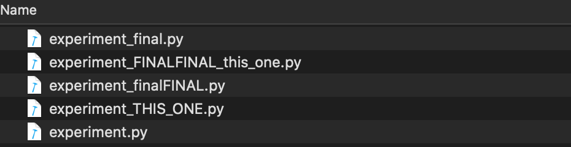
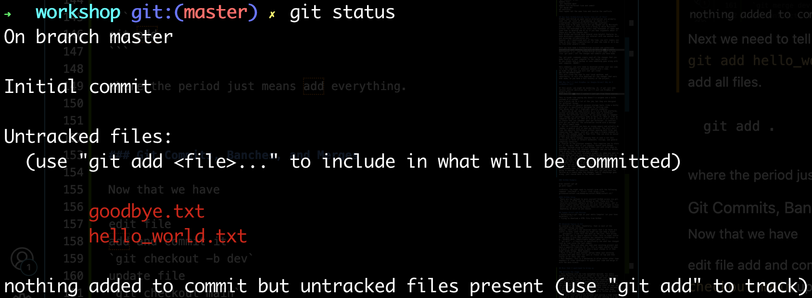
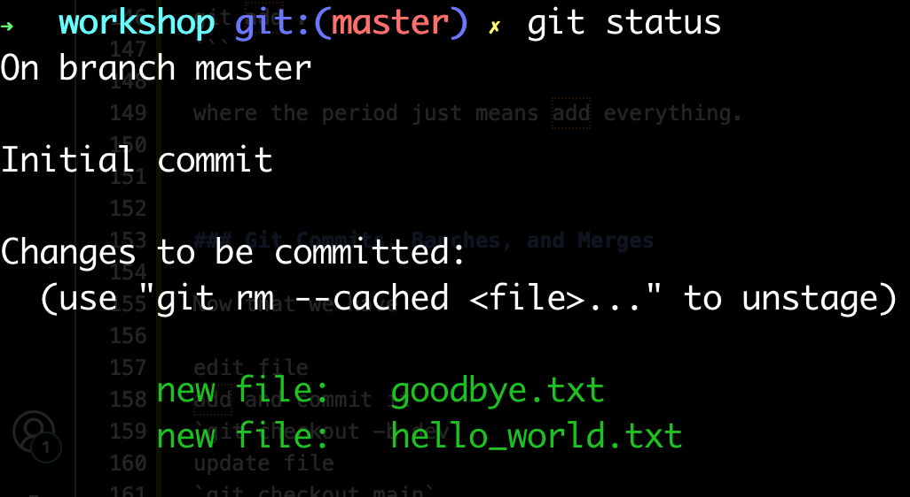
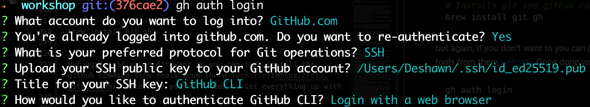
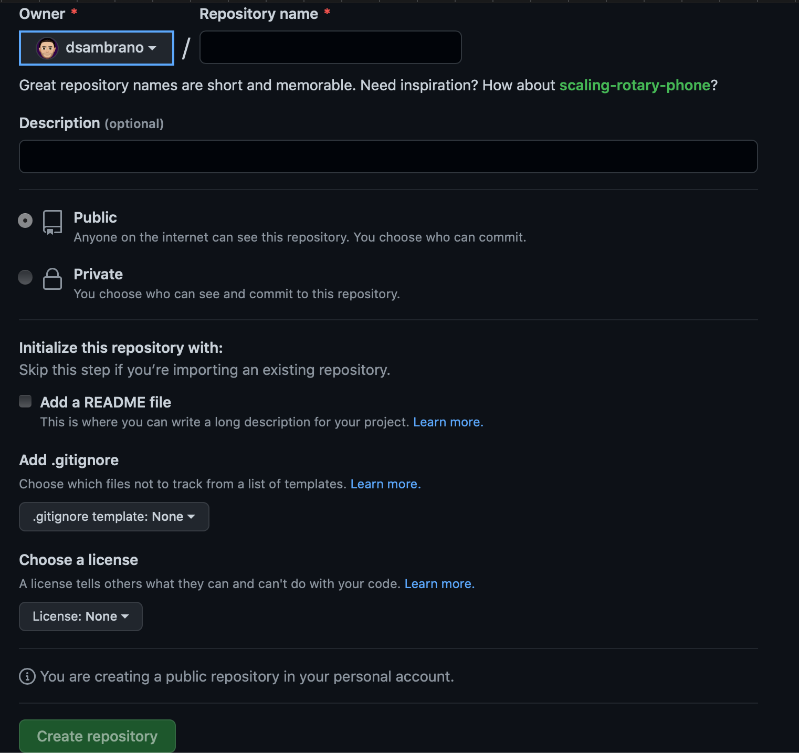
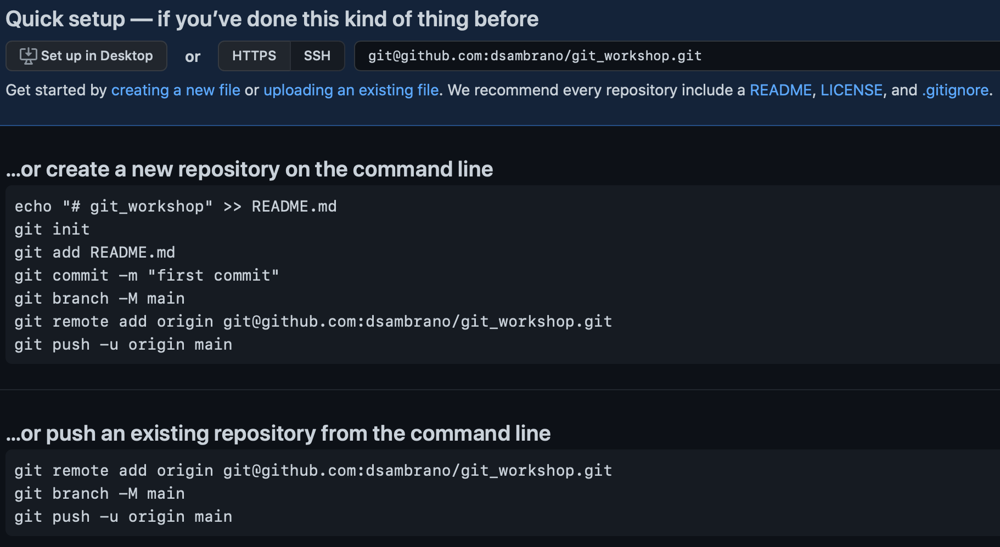

## Takeaways

[Estimated Read Time 20 mins]

In this blog you will learn the basics of Git and GitHub/GitLab:
- By the end you will know the 4 stages of the git process
- All the commands relevant to initalizing and working with a git project
- Set up your first Git repository
- Set up your first online repository (via either GitHub or GitLab)
- Be able to collaborate with any other scientist using Git

Prerequisites:
- None; though it may be helpful to skim through the [Command Line (Bash/zsh)](cli.md) post first, especially if you do not know how to use the terminal or how to use a bash. 

## You Only Need to Know 3 Commands
Git often seems super scary, so let me just start by saying that 85% of the time you will only use the following three commands. 

```
git add .
git commit -m "Relevant Message Describing Changes"
git push
```

And if you are feeling fancy and want more coverage, adding these six commands will cover 99% of what you need in scientific settings:

```
git init
git clone
git status
git pull
git checkout (-b)
git branch
```

If, for whatever reason, you are still scared off, there are GUI options to take advantage of to use of git (including built into R and VS code and even Desktop app). 
I won't cover them here; however, this blog will still be useful for you as I will cover the structure of git and help you understand what is happening at a high level. 

# What is Git?
Git is a Version Control System, thats all. Its sole purpose is to help you (pontentially from your self). 
And speaking from personal experience, getting comfortable with these commands has saved me from hours of headache. 

Here are a few examples of things that it can save you from:
- When you try to improve your codes performance, readbility, or just adding a new feature and somehow everything stops working. 
- Save you from the hell of having multiple versions of a file, all of which are named: 
- Prevent the issue of having different versions on different computers
- All easy collaboration on coding files allowing everyone to edit the same file and merge all the changes when it is convenient. 
- Have a history of all the changes you have made with the ability to revert back to a point when the code was working. 


<!-- ### Story Time 

One time I had a very large project (totally several thousand lines of code all together across maybe 10 or so files). 
The project was fully functional but is was not very fast (in fact it was quite slow) and it wasn't documented very well. 
As a result, I decided to fix both problems. 
I started working on improving both issues and after a couple days I noticed that the code broke. 
But I had no idea how or why it stopped working. 
Now if I wasn't using git, I would have been screwed. But luckily, all I had to do was revert back to the previously working commit and I had a fully working version.  -->


## Git Stages?
There are 3(4?) basic stages of git. And a file can be in any of these stages. 


- `Untracked`: The first and easiest to understand is `Untracked` this is simply a file that is not even in the directory/folder git is tracking ***OR*** a file you have specifically told git to ignore/not track any changes for it.
- `Unmodified`: These are files that you asked git to track but they have not changed since you last made a commit (i.e., made a checkpoint).
- `Modified`: These are also files you asked git to track, but these have changed since the last commit.
- `Staged`: Finally, you have files that you have told git to track, made changes to these files, AND you have already added them to the queue (via `git add FILENAME`) and are waiting for the commit and message (via `git commit -m "REALLY IMPORTANT MESSAGE"`). Once you have committed the changes, all staged files are now officially `unmodified`. Then the cycle continues. 

## Git Example Time

### Installation
First double check if you have git installed already via typing `git -v` in your terminal. 
If you get a command not found error then you don't have it install if it spits out a version then you are good to go (though you may need to update it) 
_________________
#### Mac OS

Many scientific applications requires `xcode` on Mac which install `git` automatically so you might have it. 
Double check by using the method described [above](#installation). 
If you don't that's ok because you will definitely need it in the future. 
Inside your terminal type the following command:
```
xcode-select --install
```

If you know what homebrew or MacPorts are you can install them via these methods as well. 

Finally, you can use the GUI installer go the [Binary installer section](https://git-scm.com/download/mac)

>**Hint**: You might want to install homebrew with the following command `/bin/bash -c "$(curl -fsSL https://raw.githubusercontent.com/Homebrew/install/HEAD/install.sh)"`

#### Linux
On most linux distros you can simply use the relavent package manager to install git. 
For example on debian based distros:
`sudo apt install git-all`

#### Windows

You can install git via `chocolately` or the [GUI installer](https://git-scm.com/download/win)
_________________

### Git Basics

Now we will follow a super basic example to `git`  an understanding (pun intended). 
First let's set up the following directory structure. 
Each of the text files should only contain 1 line of text that is just the same as the name of the file without and extension. 
So the `hello_world` file can just be have the content `Hello World`. 

```
my_first_git_project/
  |-- hello_world.txt
  |-- goodbye.txt
```

Next we need to create a `README.md` file. These are super important and as the name implies you should alwasy read this before using some software/code you get online.

>**Hint**: This also means that you should always make a readme file anytime you make a project. 

In this file you will find basic information about how to setup/configure and run the code that you download. 
It also often describes the basic functionality of the code as this is the first thing anyone will see about the project. 
On GitHub/GitLab. 
For our purposes since this is a basic project you can just add the level 1 header and a 1 line description.
```md
# My first Git Repo

Learning the basics of the a Git!
```

Next we are going to set up your username and email for all the changes that you will make. 
This isn't required but its super simple so might as well do it. 

```bash
git config --global user.name "Deshawn Sambrano"
git config --global user.email DSambrano@g.harvard.edu
```

Now that that is all taken care of, we can initialize your repo with 

```bash
git init
```
>**Hint**: Make sure you are already `cd`'d into the correct directory. 
It is common mistke for people initlized there home folder `/Users/Deshawn/` which will track your entire computer 😱! 
Even I did it when I frist started 😅. But don't worry you can just remove any `.git` dir to stop tracking. 

You can confirm everything worked correctly with the `ls -a` command. 
If you see an output that shows a `.git` file then you have correctly init'd your repo 🎉.

You can also use `git status` to see the status of the repo. 
This is a helpful command that will tell you what branch you are on, and shows all the files in the directory and which stage they are in. 

Next we need to tell get to track all the files. We can do this individually with `git add hello_world.txt goodbye.txt` or you can use the shortcut to add all files.

```
git add .
```

where the `.` just means add everything. Once done, the `git status` will update letting you know everything is ready to be commited.
<br><br>
 
<br><br>

And the final step is to tell `git` to save all the changes in a checkpoint for you. 
This can be done with: 

```
git commit -m "Relevant Message"
```
For the message since this is the first one ***Inital Commit*** works, but for all future commits, I recommend that you make something that concisely explains the changes that are being made.

Each time we want to save the current state of the repo we need to add all relevant files (most of the time you just add everything with `git add .`) and then commit them with a relevant message `git commit -m "Important message"`


---
need to add infor about the `.gitignore`

---

### Git Banches and Merging


---
Now that we have 

edit file
add and commit it
`git checkout -b dev`
update file
`git checkout main`
update file different line and commit
`git merge dev`
no conflicts 
then repeat but the same line and resolve the conflicts

---

## How Does GitHub/GitLab Factor Into all of This?
GitHub (and GitLab an open source alternative) are primarly used (for our level of programming) as remote (i.e., cloud-based) repositories/server/storage locations. 
GitHub used to be open source but was bought out by Microsoft and no longer is (there was also a thing in which Microsoft without the knowledge of its users took thousands of repos and used them to develop and AI so if you hear arguments about it these are the two reasons why). 
Both GitHub and GitLab have several nice helpful features to make developers communicate and interact with one another more and encourage collaboration etc. 
However, as I meantioned most of the time, you will simply use them as only repos (repositories) of your own code or as a way to find other people's code. 

Once you have made a GitHub/GitLab account and authorized yourself on your machine, you will be able to add a remote destination (i.e., your GitHub/GitLab account page) to push (via `git push`) all the changes and commits you have made. 

The `git push` commands simply send all the changes that you made locally on your computer to the remote server. 
No you always have a backup in case something goes wrong with your computer, WAHOO!!

Very commonly, you will need to download either your own code (to a new computer) or download someone else's code. 
In order to do this you will use `git clone URL-TO-THE-REMOTE-REPO`. 
This will clone the repo to your local machine, and importantly, it will also download all the changes that were ever made, so you have a full history of the project. 

### Why Can't I Just DropBox (or Google Drive)? Why do I ***Need*** Git?

At this point, you might be wondering, ok, if git just adds version control abilities why can't I just use DropBox or Google Drive. 
What does Git add that I couldn't just get from these sources. 

This is kinda like saying why doesn't a surgeon use a knife instead of a scalpel.
Sure a knife can do a lot of the job, but they are designed for different things. 
DropBox/Drive are general purpose storage tools (like a knife) while git is specifically designed for writing code. 
That being said, let's highlight specific examples: 
1. While you do get some history of a file on both platforms, neither provides any information about what is different between the different versions. So you would need to remember what changes you personally made on April 23, 2022 at 4:00 pm compared the April 23, 2022 at 4:15 pm. First of all there is no chance that you remember what was different. In contrast, with git you have all the information stored with a message for every commit made. 
2. But let's pretend you have an insane memory and actually do remeber a general gist of what was differnt. You still won't find the specific differences without opening both files and comparing them. Again, with git, you have a single command to see all the changes made to that file. They can also be easier viewed view GitHub/GitLab. 
3. Git does Delta changes meaning that it uses a lot less resources in terms of network bandwidth, storage, and general computing resources. 
4. Similar to the previous example, This requires you to store all of the data. What if you computer doesnt have enough storage. Instead using Git and GitHub, you will only need to download and store the relevant components and you can delete them at any time to reclaim your storage. 
5. And perhaps the most relatable example is, when you want to change code (and you are using DropBox/Google Drive) what do you do. My bet, is that you comment out the old code and create the new code (that way if something breaks you can always go back). But what if somehting doesn't break right away. What if it takes a while to realize that this caused a problem. Are you just going to leave the old commented version in there for ever? If you do then you won't have very maintainable code, because the amount of comments are quickly going to explode. In constrast, with git, you just save the version as a commit make the changes, and if *anything* goes wrong, just rewind back to the latest commit. 


### GitHub Example
If you did not install brew before it would be a good idea to do so now: 
```bash
# Installs homebrew
/bin/bash -c "$(curl -fsSL https://raw.githubusercontent.com/Homebrew/install/HEAD/install.sh)"

# Installs git and github command line tools
brew install git gh
```

but again, if you don't want to you can just install the github command line tools from there [website](https://cli.github.com). 
Once done you will need to set everything up with `git auth login` and follow the on screen prompt

<!-- ```
gh auth login 
``` -->
 



#### GitHub CLI Setup
There are two methods to give yourself GitHub access via git. The first is `HTTPS` and the second is `SSH`. 
These are two security protocols (details on `SSH` in a future post), but it doesnt really matter which one you pick, but you have to know which one you are using because there are some slight changes depending on which on you choose. 
I personally use `SSH`, but again it doesnt matter.

#### GitHub Repo Setup

When you create a new repo on Github you will be prompted with the following options. Fill them as needed until you get the next section. 


Assuming you did not add a `README.md`, `.gitignore` or `license` then you will see the follow screen. 


Following these prompts will get you set up, but I do want to highlight what each are doing so you don't need to follow them ever time. 
The `echo` line creates a `README` file with a title header.
Next we had the `git init` which initializes a repo, as we showed above. 
Next we are asked to add the `README` file and `git commit` it.
Afterwards it uses the `git branch -M main` to rename to current branch to `main` which is the default branch naming scheme for GitHub. 
Then, we use `git remote add` to add the newly created GitHub repo as the remote repo for this project, and we give it a nickname called `origin`. 
Finally, we push the all local commits with `git push` and the `-u orign main` option/arguments tell git to always use this particular GitHub repo for this branch. 

>**Hint**: You can actually store different branches on different repos (or the same repo, which is the most common).

## Common Errors and Hiccups
- Initalizing a git repo on your whole Computer (or your home directory `~`)
- Trying to download a HTML file from GitHub 


## Advanced Topics in Git
We covered a lot today, thankfully, that is most of the important things you need. 
However, there are a few advanced topics that I do think are useful to know, even though you might not use them a bunch:
- `.gitignore`: I use this the most on the list. This allows you to tell git to ignore specific files. This is super useful if you have a file that contains any sensative information (e.g., SECRETE_KEYS, Identifiable Subject data, etc.). 
- `git diff `: a function to specifically see what has changed line by line since the last commit
<!-- - Branches: These are when you take your existing project and have a seperate timeline for it. This is super useful to make a branch if you are going to make a major change to it that might break things. Need example -->
- Fork: A fork is when another person takes your existing projects and adds their own spin or flavor on top and then stores it on their own repo. 
- Pull Request: This is a mechanism to allow either other team memebers or other developers to update your code and merge it with the main branch. 


## Homework
I want you to take one of your projects and initialize it as a git project and store it remotely. 
This can be as a private repo if need be
